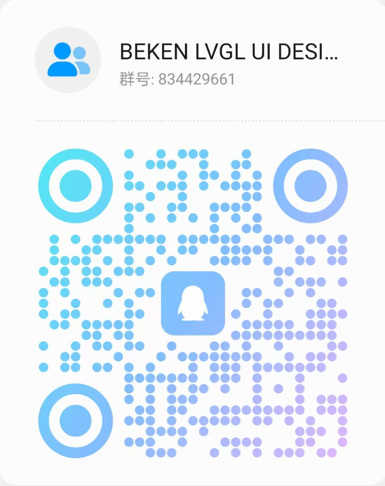

# BEKEN LVGL UI Designer

> 一款专业的 LVGL 图形界面可视化设计工具，帮助您快速设计和开发嵌入式设备的用户界面。

## 📖 项目简介

BEKEN LVGL UI Designer 是一个面向嵌入式设备 UI 开发的可视化设计工具，基于 LVGL（Light and Versatile Graphics Library）图形库开发。通过拖拽式操作和实时预览，让您能够快速构建美观、高效的嵌入式设备用户界面，无需手写大量代码即可完成 UI 设计工作。

## ✨ 核心功能

### 🎨 可视化设计
- **拖拽式组件设计** - 通过简单的拖拽操作即可将组件添加到画布
- **实时预览** - 所见即所得，实时查看设计效果
- **网格和参考线辅助** - 精确对齐组件，提升设计效率

### 🧩 丰富的组件库
- **30+ 种 LVGL 组件** - 涵盖常用 UI 控件和高级组件
- **常用控件** - 按钮、输入框、滑块、列表等基础控件
- **高级组件** - 图表、仪表盘、进度条、日历等复杂组件
- **自定义组件支持** - 支持创建和复用自定义组件库

### ⚙️ 强大的样式系统
- **完整的 LVGL 样式属性支持** - 覆盖所有 LVGL 样式配置项
- **多状态样式编辑** - 支持组件的不同状态样式设置
- **样式库保存和复用** - 保存常用样式，快速应用到其他组件

### 📁 项目管理
- **多项目管理** - 轻松管理多个 UI 项目
- **项目导入** - 方便项目迁移和分享
- **示例模板** - 内置多种项目模板，快速开始设计

## 🚀 快速开始

### 系统要求

- Windows

### 下载链接

https://dl.bekencorp.com/tools/lvgl_ui_designer

## 📚 文档

- [快速开始指南](doc/zh-cn/getting-started.md) - 5分钟快速上手指南
- [工作台使用](doc/zh-cn/workspace.md) - 详细的工作台功能介绍
- [常见问题](doc/zh-cn/faq.md) - 常见问题解答
- [版本历史](doc/zh-cn/release-notes.md) - 常见问题解答
- [完整文档目录](doc/zh-cn/) - 查看所有文档

## 🔜 开发中的功能

以下功能正在积极开发中，敬请期待：
- [x] **完整的事件处理支持** - 为组件添加完整的事件处理支持
- [x] **Flex 布局支持** - 为容器组件提供灵活的 Flex 布局支持
- [x] **组件State和Flags设置** 
- [ ] **云端资源库** - 从云端获取组件模板、样式等资源
- [ ] **快速部署到开发板** 

## 🤝 社区与支持

### 反馈与交流

- 📧 **问题反馈** - 如遇到问题或有功能建议，欢迎提交 [Issue](../../issues)
- 💬 **社区讨论** - 加入我们的社区群组，与其他开发者交流
  - **QQ 群**: 834429661 (BEKEN LVGL UI DESIGNER)
  
    

## 📄 许可证

本项目采用 [MIT License](LICENSE) 许可证。

## 🙏 致谢

感谢 [LVGL](https://lvgl.io/) 项目提供的强大图形库支持。

---

**BEKEN LVGL UI Designer** - 让嵌入式 UI 开发更简单、更高效！
