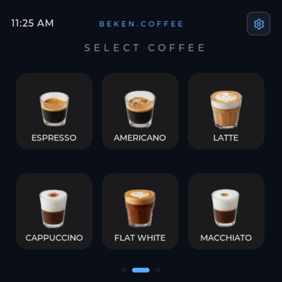
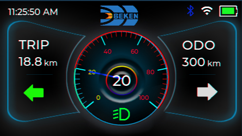
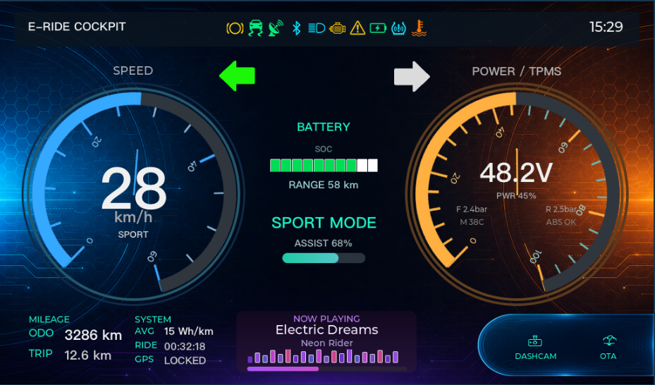
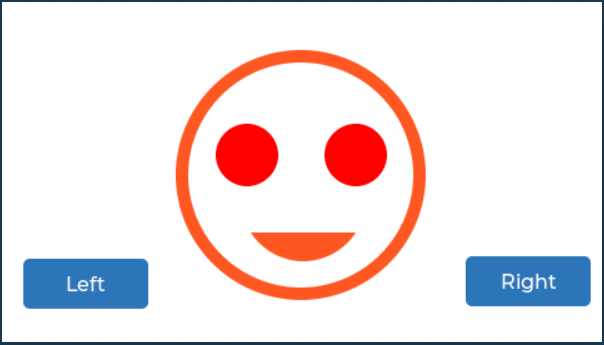
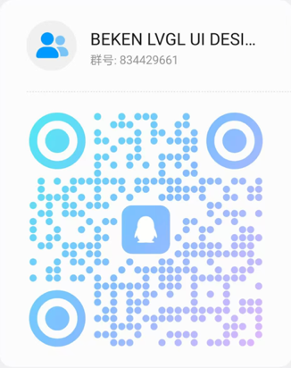

# BEKEN LVGL UI Designer

[License](LICENSE)

**Language**: 中文 | [English](README_EN.md)

> 一款专业的 LVGL 图形界面可视化设计工具，帮助您快速设计和开发嵌入式设备的用户界面。

## 📖 项目简介

BEKEN LVGL UI Designer 是一个面向嵌入式设备 UI 开发的可视化设计工具，基于 LVGL（Light and Versatile Graphics Library）图形库开发。通过拖拽式操作和实时预览，让您能够快速构建美观、高效的嵌入式设备用户界面，无需手写大量代码即可完成 UI 设计工作。您可以通过观看[博通集成UI开发工具“BEKEN LVGL UI Designer”介绍](https://www.bilibili.com/video/BV1jG2sBLEVS/?vd_source=eba4c960ff48c12219b5e4e5051256bf)视频，进一步了解该工具的核心功能。

## ✨ 核心功能

### 🎨 可视化设计

- **拖拽式组件设计** - 通过简单的拖拽操作即可将组件添加到画布
- **实时预览** - 所见即所得，实时查看设计效果
- **网格和参考线辅助** - 精确对齐组件，提升设计效率

### 🤖 AI 设计

- **AI 编辑器协同设计** - 可结合 Cursor、TRAE 等 AI 编辑器和工具，通过自然语言描述进行 UI 交互设计

> 🎬 点击图片观看 AI 设计功能演示视频

### 🧩 丰富的组件库

- **30+ 种 LVGL 组件** - 涵盖常用 UI 控件和高级组件
- **常用控件** - 按钮、输入框、滑块、列表等基础控件
- **高级组件** - 图表、仪表盘、进度条、日历等复杂组件
- **自定义组件支持** - 支持创建和复用自定义组件库

### ⚙️ 强大的样式系统

- **完整的 LVGL 样式属性支持** - 覆盖所有 LVGL 样式配置项
- **多状态样式编辑** - 支持组件的不同状态样式设置
- **样式库保存和复用** - 保存常用样式，快速应用到其他组件

### 📁 项目管理

- **多项目管理** - 轻松管理多个 UI 项目
- **项目导入** - 方便项目迁移和分享
- **示例模板** - 内置多种项目模板，快速开始设计

## 🚀 快速开始

### 系统要求

- Windows

### 下载链接

[https://dl.bekencorp.com/tools/lvgl_ui_designer](https://dl.bekencorp.com/tools/lvgl_ui_designer)

## 📚 文档

- [快速开始指南](doc/zh-cn/getting-started.md) - 5分钟快速上手指南
- [工作台使用](doc/zh-cn/workspace.md) - 详细的工作台功能介绍
- [常见问题](doc/zh-cn/faq.md) - 常见问题解答
- [版本历史](doc/zh-cn/release-notes.md) - 常见问题解答
- [完整文档目录](doc/zh-cn/) - 查看所有文档

## 🎯 项目示例

我们提供了多个完整的项目示例，帮助您快速了解和学习如何使用 BEKEN LVGL UI Designer。点击下方图片可查看对应的示例项目。

### ☕ 咖啡机

一个咖啡机控制界面示例，展示了多种咖啡类型选择、进度显示、设置界面等复杂 UI 组件的使用。

### 📹 两轮车-示例1

两轮车单页面示例，包含状态指示、导航信息、设备连接状态等常用嵌入式设备 UI 元素。

### 🛴 两轮车-示例2

行车记录仪示例，展示了行车记录、导航、OTA 升级等多页面嵌入式设备 UI 设计。

### ⏱️ 时间轴动画

时间轴动画示例，展示了通过时间轴编排实现多元素联动动画的页面效果。

更多示例，请查看 <a href="examples/">项目示例</a>

## 🤝 社区与支持

### 反馈与交流

- 📧 **问题反馈** - 如遇到问题或有功能建议，欢迎提交 [Issue](../../issues)
- 💬 **社区讨论** - 加入我们的社区群组，与其他开发者交流
  - **QQ 群**: 834429661 (BEKEN LVGL UI DESIGNER)
    

## 🤝 参与贡献

我们非常欢迎社区贡献！您的贡献可以帮助更多开发者学习和使用 BEKEN LVGL UI Designer。

### 📦 贡献项目案例

如果您使用 BEKEN LVGL UI Designer 创建了优秀的 UI 项目，欢迎您将项目案例分享到 `examples` 目录中！

**如何贡献：**

1. **Fork 本项目** - 在 GitHub 上 Fork 本仓库
2. **准备您的项目** - 确保您的项目包含以下内容：
  - 项目文件（`.bkprj` 文件）
  - 项目截图（至少一张，建议命名为 `ScreenShot_1.png`）
  - 资源文件（如有使用，放在 `assets` 目录中）
  - 项目说明（可选，可创建 `README.md`）
3. **提交 Pull Request** - 在 `examples` 目录下创建您的项目文件夹，提交 Pull Request
4. **等待审核** - 我们会审核您的提交，对于优秀案例，我们将在 README 中进行展示

**优秀案例标准：**

- ✅ 界面设计美观、实用
- ✅ 包含完整的项目文件和资源
- ✅ 有清晰的截图展示
- ✅ 能够帮助其他开发者学习

**注意事项：**

- 请确保您拥有所提交项目的完整版权
- 提交的项目应使用 BEKEN LVGL UI Designer 创建

感谢您的贡献！🎉

## 📄 许可证

本项目采用 [MIT License](LICENSE) 许可证。

## 🙏 致谢

感谢 [LVGL](https://lvgl.io/) 项目提供的强大图形库支持。

---

**BEKEN LVGL UI Designer** - 让嵌入式 UI 开发更简单、更高效！