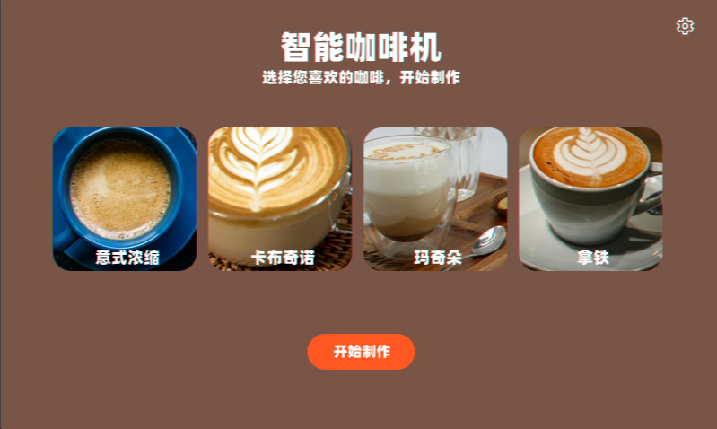
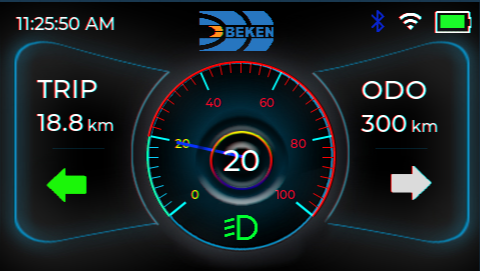
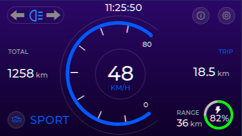
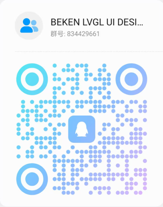

# BEKEN LVGL UI Designer

> A professional LVGL graphical interface visual design tool that helps you quickly design and develop user interfaces for embedded devices.

**Language**: [中文](README.md) | English

## 📖 Project Introduction

BEKEN LVGL UI Designer is a visual design tool for embedded device UI development, based on the LVGL (Light and Versatile Graphics Library) graphics library. Through drag-and-drop operations and real-time preview, you can quickly build beautiful and efficient user interfaces for embedded devices without writing large amounts of code. You can watch the [BEKEN LVGL UI Designer Introduction Video](https://www.bilibili.com/video/BV1jG2sBLEVS/?vd_source=eba4c960ff48c12219b5e4e5051256bf) to learn more about the core features of this tool.

## ✨ Core Features

### 🎨 Visual Design
- **Drag-and-Drop Component Design** - Add components to the canvas through simple drag-and-drop operations
- **Real-Time Preview** - What you see is what you get, view design effects in real-time
- **Grid and Guide Lines** - Precisely align components and improve design efficiency

### 🧩 Rich Component Library
- **30+ LVGL Components** - Covering common UI controls and advanced components
- **Common Controls** - Basic controls such as buttons, input fields, sliders, lists, etc.
- **Advanced Components** - Complex components such as charts, dashboards, progress bars, calendars, etc.
- **Custom Component Support** - Support for creating and reusing custom component libraries

### ⚙️ Powerful Style System
- **Complete LVGL Style Property Support** - Covering all LVGL style configuration items
- **Multi-State Style Editing** - Support for different state style settings for components
- **Style Library Save and Reuse** - Save commonly used styles and quickly apply them to other components

### 📁 Project Management
- **Multi-Project Management** - Easily manage multiple UI projects
- **Project Import** - Convenient project migration and sharing
- **Example Templates** - Built-in various project templates to quickly start designing

## 🚀 Quick Start

### System Requirements

- Windows

### Download Link

https://dl.bekencorp.com/tools/lvgl_ui_designer

## 📚 Documentation

- [Getting Started Guide](doc/en/getting-started.md) - 5-minute quick start guide
- [Workspace Usage](doc/en/workspace.md) - Detailed workspace feature introduction
- [FAQ](doc/en/faq.md) - Frequently asked questions
- [Release Notes](doc/en/release-notes.md) - Release notes
- [Complete Documentation Directory](doc/en/) - View all documentation

## 🎯 Project Examples

We provide multiple complete project examples to help you quickly understand and learn how to use BEKEN LVGL UI Designer. Click on the images below to view the corresponding example projects.

### ☕ Coffee Machine

A coffee machine control interface example that demonstrates the use of complex UI components such as multiple coffee type selection, progress display, and settings interface.

### 📹 Two-Wheeler - Example 1

A single-page two-wheeler example containing common embedded device UI elements such as status indicators, navigation information, and device connection status.

### 🛴 Two-Wheeler - Example 2

A multi-page two-wheeler example showcasing typical dashboard UI design such as speed display, battery indicator, mode switching, and settings interface.

For more examples, please check <a href="examples/">Project Examples</a>

## 🔜 Features in Development

The following features are actively under development, stay tuned:
- [x] **Complete Event Handling Support** - Add complete event handling support for components
- [x] **Flex Layout Support** - Provide flexible Flex layout support for container components
- [x] **Component State and Flags Settings**
- [ ] **Cloud Resource Library** - Get component templates, styles, and other resources from the cloud
- [ ] **Quick Deployment to Development Board**

## 🤝 Community and Support

### Feedback and Communication

- 📧 **Issue Feedback** - If you encounter problems or have feature suggestions, please submit an [Issue](../../issues)
- 💬 **Community Discussion** - Join our community groups to communicate with other developers
  - **QQ Group**: 834429661 (BEKEN LVGL UI DESIGNER)
  
    

## 🤝 Contributing

We warmly welcome community contributions! Your contributions can help more developers learn and use BEKEN LVGL UI Designer.

### 📦 Contributing Project Examples

If you have created an excellent UI project using BEKEN LVGL UI Designer, we welcome you to share your project example in the `examples` directory!

**How to Contribute:**

1. **Fork This Project** - Fork this repository on GitHub
2. **Prepare Your Project** - Make sure your project includes the following:
   - Project file (`.bkprj` file)
   - Project screenshots (at least one, recommended name: `ScreenShot_1.png`)
   - Resource files (if used, place them in the `assets` directory)
   - Project description (optional, you can create a `README.md`)
3. **Submit Pull Request** - Create your project folder under the `examples` directory and submit a Pull Request
4. **Wait for Review** - We will review your submission, and for excellent examples, we will showcase them in the README

**Excellent Example Criteria:**
- ✅ Beautiful and practical interface design
- ✅ Contains complete project files and resources
- ✅ Has clear screenshot display
- ✅ Can help other developers learn

**Notes:**
- Please ensure you have full copyright of the submitted project
- Submitted projects should be created using BEKEN LVGL UI Designer

Thank you for your contribution! 🎉

## 📄 License

This project is licensed under the [MIT License](LICENSE).

## 🙏 Acknowledgments

Thanks to the [LVGL](https://lvgl.io/) project for providing powerful graphics library support.

---

**BEKEN LVGL UI Designer** - Making embedded UI development simpler and more efficient!

